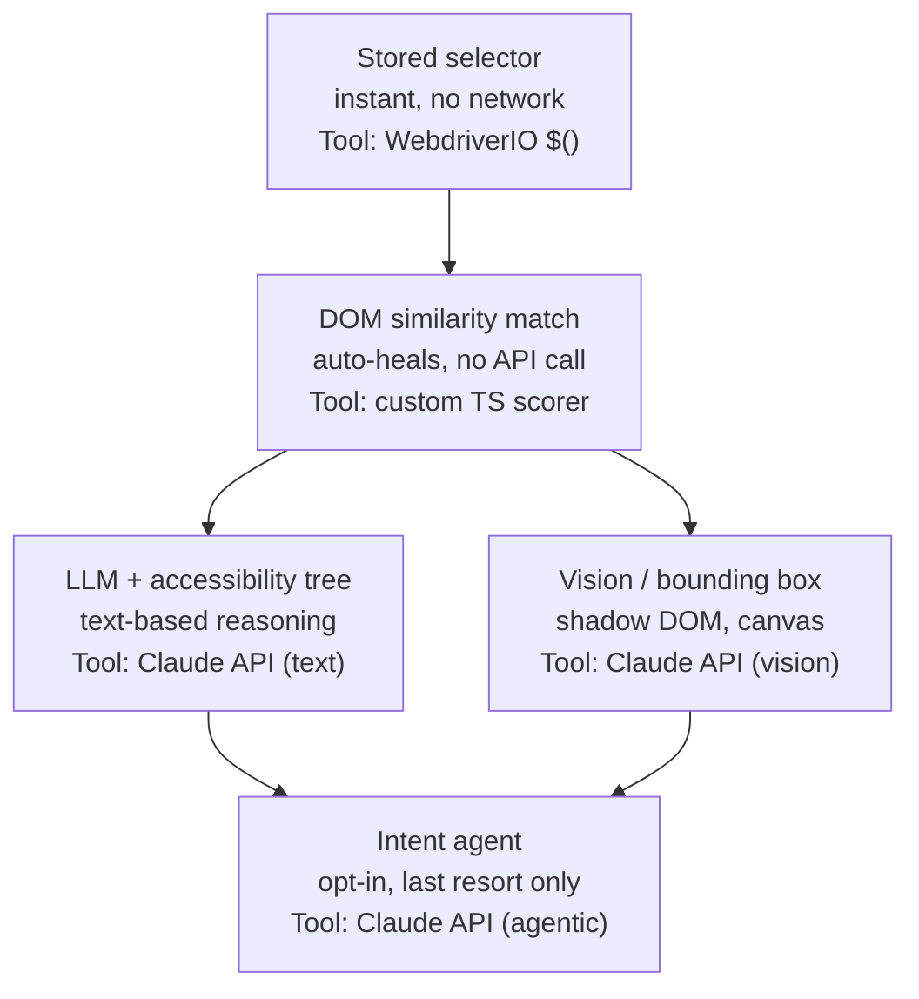
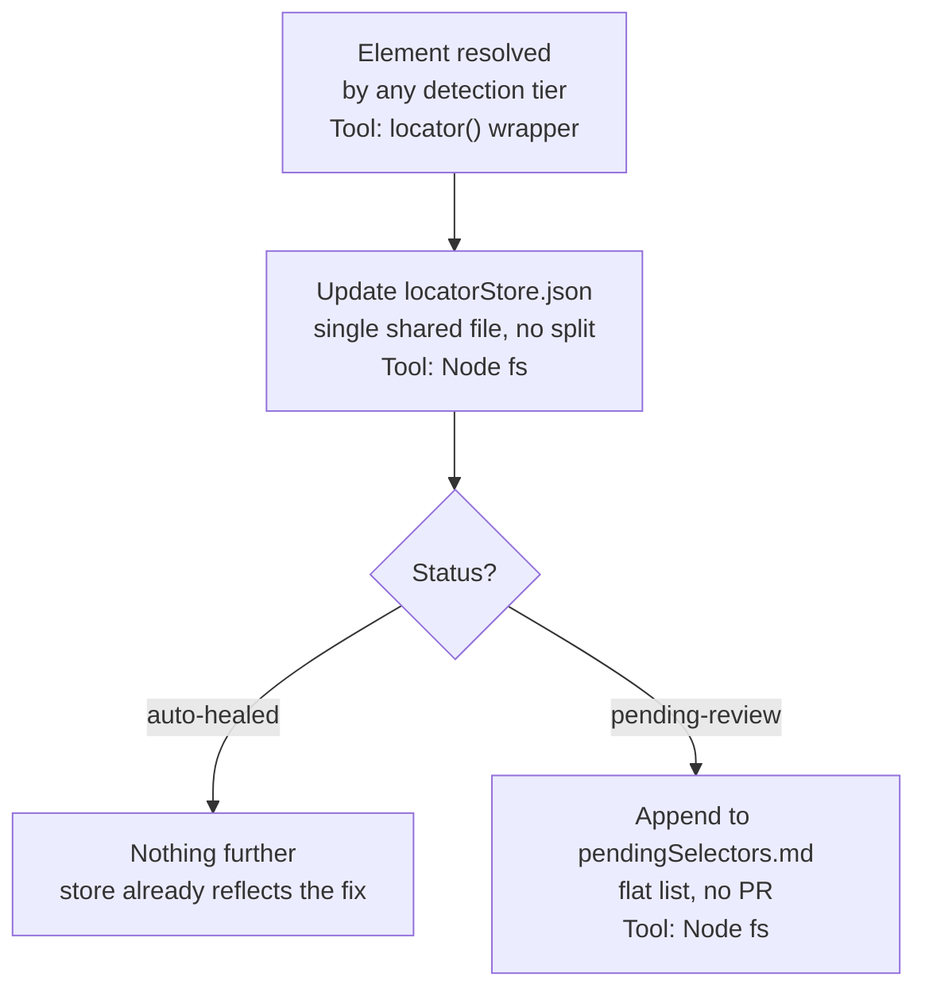

# Selector Drift Checker — POC Spec (v4: Scoped for POC)

## What it is

A resilience layer for a WebdriverIO + TypeScript automation suite, built on top of a **Page Object Model (POM)** structure (`E2E -> helpers / pageobjects / specs`). It replaces direct selector calls inside page objects with a `locator()` indirection that escalates through a tiered set of resolution engines when a selector breaks, and persists whatever resolved the element back to a shared locator store — never rewriting `pageobjects` or `specs` source files directly.

**Goal for this phase:** POC → internal TechShare demonstrating the hybrid escalation model, each tier backed by a specific, named tool, running inline inside a real WDIO POM suite.

## Where this fits in the POM structure

```
e2e/
  helpers/
    locator.ts          <- the resolution engine
    locatorStore.ts      <- read/write the shared JSON store
  pageobjects/
    checkout.page.ts     <- selectors replaced with locator() calls
    login.page.ts
  specs/
    checkout.spec.ts     <- unchanged — specs never touch selectors directly
  locatorStore.json      <- one shared store for the whole suite
  pendingSelectors.md    <- generated report of selectors needing manual update
```

- **`specs/` never change.** Specs call page object methods, exactly as today.
- **`pageobjects/` change from direct selectors to `locator()` calls** — the only place engineers touch when adopting this.
- **`helpers/` hosts the resolution engine and the store read/write layer.**

```typescript
// pageobjects/checkout.page.ts
import { locator } from '../helpers/locator';

class CheckoutPage {
  get submitButton() {
    return locator('checkout.submit_button');
  }
}
```

## Detection tiers — what runs, and the tool behind each one

`locator()` tries each tier in order and stops at the first one that resolves the element:



| Tier | Purpose | Tool | Auto-commits? |
|---|---|---|---|
| 0 — Stored selector | Fast path, the common case | WebdriverIO's own `$()` / element resolution | n/a — nothing to commit |
| 1 — DOM similarity match | Structural drift (renamed class, moved node) | Custom TypeScript similarity scorer, weighted over the stored `snapshot` | Yes, above confidence threshold |
| 2a — LLM + accessibility tree | Semantic drift (relabeled button, reorganized form) | Claude API, text mode — `intent` + snapshot + live accessibility tree | No — always `pending-review` |
| 2b — Vision / bounding box | Shadow DOM, Canvas, CSS-in-JS hash classes — no usable DOM to reason over | Claude API, vision mode — screenshot + bounding-box resolution | No — always `pending-review` |
| 3 — Intent agent | Last resort, opt-in only, reserved for flows too volatile for anything above | Claude API, agentic mode — full reasoning + action synthesis | No — always `pending-review` |

Tier 2 is config-driven per project (2a, 2b, both, or neither). Tier 3 stays opt-in everywhere given its cost and non-determinism. Every AI-driven tier runs on the **Claude API** — one API surface, one auth path, instead of mixing vendors.

## Persistence — scoped down for the POC

For this phase, persistence is deliberately simple: **one shared store, one flat report file, no PRs.**



| Aspect | POC decision |
|---|---|
| Store granularity | One shared `locatorStore.json` for the whole suite — no per-page-object split |
| Review surface | `pendingSelectors.md` — a flat, generated Markdown file listing every `pending-review` entry (id, old selector, proposed selector, confidence, reasoning). No CI summary or Slack notification for now |
| Concurrency | Not handled at this stage — POC assumes non-parallel or accepts last-write-wins |
| Committing fixes back to source | Manual — an engineer reads `pendingSelectors.md` and decides whether to update the page object by hand. No Auto-PR, no GitHub/GitLab API dependency |

This trims the scope from v3 in one direction only — automated commit-back (Auto-PR) is deferred, not the detection tiers, which are unchanged. Auto-PR remains a natural "next step after the POC" extension once the review-surface and git-host questions are worth solving for real.

## Locator store schema

```json
{
  "version": "1.0",
  "locators": {
    "checkout.submit_button": {
      "id": "checkout.submit_button",
      "selector": "[data-testid='submit-order-btn']",
      "intent": "Primary submit button on the checkout form that finalizes the order",
      "created_at": "2026-06-01T10:00:00Z",
      "last_verified_at": "2026-09-20T14:32:00Z",
      "snapshot": {
        "tag": "button",
        "attributes": {
          "id": "submit-order-btn",
          "class": "btn btn-primary checkout-cta",
          "role": "button",
          "aria-label": "Submit order"
        },
        "text_content": "Submit Order",
        "dom_path": "form.checkout > div.actions > button",
        "sibling_context": {
          "preceding_text": "Cancel",
          "parent_tag": "div.actions"
        },
        "position": { "x": 480, "y": 720 }
      },
      "history": [
        {
          "date": "2026-08-15T09:00:00Z",
          "strategy": "dom-similarity",
          "old_selector": "#submit-btn",
          "new_selector": "[data-testid='submit-order-btn']",
          "confidence": 0.91,
          "status": "auto-healed",
          "reviewed_by": null
        }
      ]
    }
  }
}
```

- `id` mirrors POM conventions (`page.element`) and is what page objects reference via `locator(id)`.
- `intent` is optional at creation, filled in on demand the first time tier 2a needs it and finds it missing.
- Status model, shared across all tiers: `verified` / `auto-healed` / `pending-review` / `broken`.

## `pendingSelectors.md` — example output

```markdown
# Pending selector reviews

## checkout.submit_button
- Old selector: `#promo-input`
- Proposed: `[data-testid='promo-code-input']`
- Confidence: 0.79
- Strategy: llm-accessibility-tree
- Reasoning: Input relabeled from "Promo code" to "Discount code"; same form
  position, same surrounding fields.
- Detected: 2026-09-23
```

One entry per `pending-review` locator, appended as they occur. An engineer reviews this file, updates the page object by hand if the proposal looks right, and (optionally) clears the entry.

## Bootstrap for old vs. new projects

**Old projects (retrofit):**
1. Run the existing suite with instrumentation wrapping WebdriverIO's element-resolution calls, capturing every selector actually invoked at runtime from inside `pageobjects/`.
2. Auto-generate locator store entries (`selector`, `snapshot`) from that capture, keyed by page-object-derived IDs.
3. Generate the replacement `locator()` lines for each page object getter as a suggested diff for the automation engineer to review and merge — a one-time, human-reviewed migration.
4. `intent` starts empty, filled in on demand per the escalation flow above.

**New projects:**
- Page objects are authored using `locator()` from day one; `intent` is written alongside each element as normal practice.

## Suggested TechShare demo arc

1. Show a `pageobjects/checkout.page.ts` file using `locator()` calls, and the store already bootstrapped from an old project's instrumented run.
2. Run the suite normally — everything resolves via tier 0 (stored selector), fast, no network calls.
3. Introduce a structural DOM change live — re-run — show tier 1 (DOM similarity, custom TS scorer) auto-heal the selector inline, test still passes, store updates silently.
4. Introduce a semantic rename — re-run — show tier 1 fail, tier 2a (Claude API, text) resolve it via `intent`, entry lands in `pendingSelectors.md`.
5. Optional stretch demo: an element inside Shadow DOM or a Canvas surface — show tier 2a fail (no usable DOM), tier 2b (Claude API, vision) resolve it via screenshot.
6. Open `pendingSelectors.md` on screen — show the flat, readable report an engineer would act on.
7. Close on the two-axis diagram: detection tiers and persistence strategies as independent, config-driven choices behind one shared `locator()` interface — noting Auto-PR as the natural next step beyond the POC.
